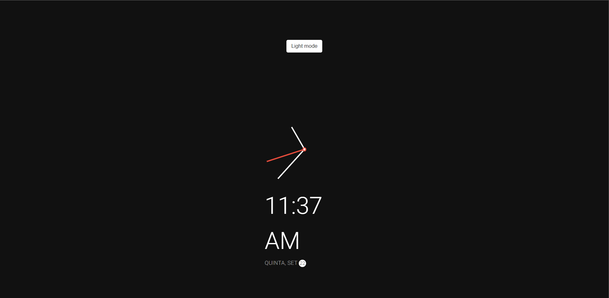

# Projeto Relogio

🔗  [Clique aqui para acessar](https://prdsilva80.github.io/relogio/)

## 🛠️ Tecnologias

  

## 👨‍🎓 O que aprendi

- Aumentei o uso do JavaScript, entendo melhor a lógica usada
- Como usar as sessões do CSS para dar corpo ao projeto
- Entendo melhor como todas as ferramentas trabalham

## 📧 Contato

<a href = "mailto:probertos717@gmail.com">
